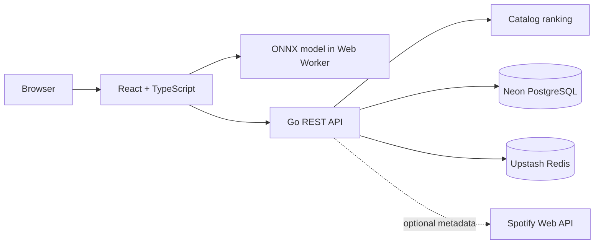

# SpotiSense

SpotiSense turns a short description of how someone feels into an explainable set of music recommendations. A React/TypeScript client performs private emotion inference in the browser, while a Go API ranks an offline music catalog and persists profiles, playlists, and recommendation history with PostgreSQL and Redis.

The application remains useful without Spotify credentials. Spotify is an optional metadata layer—not a recommendation dependency.

## Product experience

- Six-way emotion analysis with a complete probability breakdown and visible inference provenance.
- Explainable track matching across valence, energy, danceability, acousticness, and instrumentalness proxies.
- Persistent listener profiles, recommendation history, and idempotent playlist saves.
- Direct Spotify search links with optional cover-art and canonical-link enrichment.
- Responsive UI, accessible states, free-tier wake-up retries, and graceful offline fallbacks.

## Architecture



Training and serving are deliberately separated. PyTorch and Hugging Face fine-tune the classifier offline; `ml/export_onnx.py` converts a checkpoint to a quantized ONNX artifact that Transformers.js can execute in a Web Worker. Raw mood text stays in the browser; the API receives only the emotion result and a SHA-256 context key.

## Stack

| Layer | Technology |
| --- | --- |
| Web | React 19, TypeScript, Vite, Transformers.js |
| API | Go 1.26, `net/http`, structured logging |
| Data | PostgreSQL with `pgx`, Redis with `go-redis` |
| ML | PyTorch, Hugging Face Transformers, ONNX Runtime, Matplotlib |
| Delivery | Docker, GitHub Actions, Vercel, Google Cloud Run |

## Run locally

The simplest zero-infrastructure workflow uses in-memory Go adapters:

```bash
npm --prefix web install
go run ./cmd/api
```

In another terminal:

```bash
cp web/.env.example web/.env.local
npm --prefix web run dev
```

Open [http://localhost:5173](http://localhost:5173). Without an exported ONNX model, the interface clearly identifies that it is using the lightweight development analyzer.

To run PostgreSQL and Redis locally as well:

```bash
cp .env.example .env
docker compose up --build
```

The web app is served at [http://localhost:5173](http://localhost:5173), and API health is available at [http://localhost:8080/healthz](http://localhost:8080/healthz).

## Train and export the emotion model

```bash
python3 -m venv .venv
.venv/bin/pip install -r requirements-ml.txt
.venv/bin/python ml/prepare_goemotions.py
.venv/bin/python ml/train_transformer.py
.venv/bin/python ml/export_onnx.py
```

Training writes the best model, evaluation metrics, a Matplotlib learning curve, and a Pickle training-state snapshot under `ml/artifacts/spotisense-emotion/`. Exporting writes the deployable model under `web/public/models/spotisense-emotion/`.

The preparation script downloads the CC BY 4.0-licensed [Google Research GoEmotions](https://github.com/google-research/google-research/tree/master/goemotions) dataset, keeps unambiguous examples, collapses related labels into the six product categories, and balances the result. The current BERT-mini model reaches `0.511` validation macro-F1 across six balanced classes. The exporter rejects checkpoints below `0.50`. This is a reproducible prototype result, not evidence for a production-quality classifier.

## Recommendation method

1. The browser model returns probabilities for `angry`, `calm`, `fear`, `happy`, `love`, and `sad`.
2. Each emotion maps to a target profile across five interpretable mood dimensions.
3. The Go catalog computes a weighted distance for every track and enforces artist diversity.
4. The browser sends a SHA-256 context key that diversifies otherwise equivalent results without transmitting the original text.
5. Redis caches a feed for 15 minutes; PostgreSQL stores the result and confidence for history.

The 750-track catalog uses deterministic, lyric-derived `lyrics-mood-proxy-v1` values. These are not Spotify Audio Features. Rebuild it with `.venv/bin/python ml/build_catalog.py`.

## API

The complete contract is in [`openapi.yaml`](openapi.yaml).

| Method | Path | Purpose |
| --- | --- | --- |
| `GET` | `/healthz` | Dependency mode and catalog health |
| `GET` | `/metrics` | Request and cache counters |
| `POST` | `/v1/profiles` | Create a demo listener profile |
| `GET` | `/v1/tracks?q=` | Search the offline catalog |
| `POST` | `/v1/recommendations` | Rank, cache, and record a feed |
| `GET` | `/v1/profiles/{id}/history` | Read recommendation history |
| `POST` | `/v1/playlists` | Create a playlist |
| `GET` | `/v1/profiles/{id}/playlists` | List saved playlists |
| `POST` | `/v1/playlists/{id}/tracks` | Save a track idempotently |

## Quality checks

```bash
make test
make lint
docker build -t spotisense-api .
docker build -f Dockerfile.web -t spotisense-web .
```

CI runs Python checks, race-enabled Go tests, TypeScript lint/tests/build, and both container builds.

## Deployment

The reference deployment is designed to fit within free allowances at demo traffic:

- Vercel: React static assets and the quantized model.
- Google Cloud Run: scale-to-zero Go API.
- Neon: pooled PostgreSQL connection.
- Upstash: TLS Redis connection.

See [`docs/DEPLOYMENT.md`](docs/DEPLOYMENT.md) for the exact setup and terminal commands. Free allowances and provider terms can change, so configure a Google Cloud budget alert before publishing.

## Spotify status

Spotify's Web API still supports metadata search, but the Recommendations and Audio Features endpoints are unavailable to newly registered development-mode applications. SpotiSense therefore ranks its own catalog and uses Spotify only for optional enrichment. Without credentials, tracks receive an `open.spotify.com/search/...` link.

## Technical highlights

- Built an emotion-aware music discovery platform using React, TypeScript, and browser-side transformer inference, with explainable ranking across a 750-track offline catalog.
- Developed a reproducible PyTorch/Hugging Face fine-tuning pipeline, visualized training and evaluation loss with Matplotlib, serialized run state, and exported a quantized ONNX model for low-cost inference.
- Designed Go REST APIs for profiles, playlists, catalog search, and privacy-aware recommendation history with PostgreSQL persistence and automated tests.
- Added Redis caching for recommendation feeds and optional Spotify metadata, with health metrics and in-memory adapters for zero-infrastructure local development.

The current demo profile is intentionally anonymous and does not provide authentication. Add OAuth or session authentication before treating it as a multi-tenant application.

## License

Application code is available under the [MIT License](LICENSE). Music titles, artist names, and Spotify marks belong to their respective owners.
